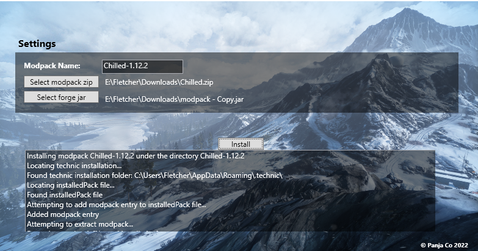

## Technic ModPack Installer (TMPI)
An application to manually install compressed modpacks for the technic launcher. It is meant to catch small issues in modpacks such as if they are packaged incorrectly or if forge is not installed properly.

<em>It's not the most useful application, just made for fun</em>

### Screenshot

### TODO
* Fix an error if the modpack is already registered in the installedPacks file
* Download compatible forge version online
  * Allow pre-packaged forge versions to make it easier on your friends
* Simple scraper to download & install packs from direct download links